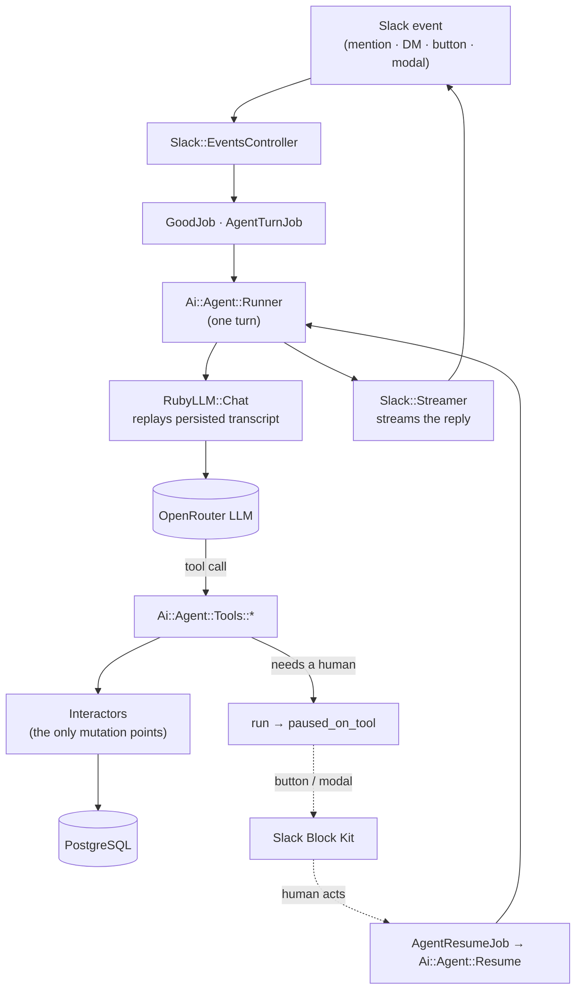
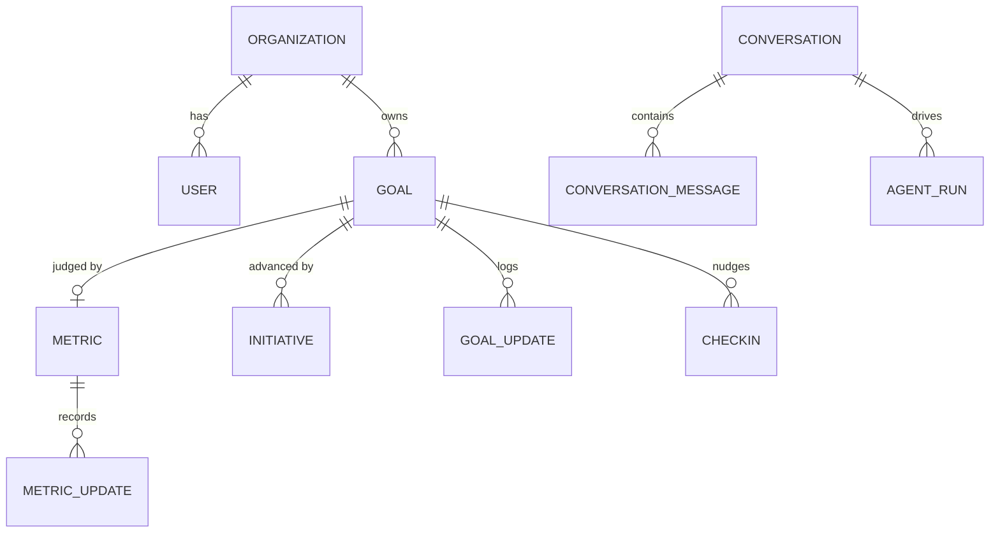

# Pincer

**An AI partner that runs your OKRs in Slack.** Teams define goals, break them
into initiatives, and Pincer's agent — reachable by `@`-mention, DM, or Slack's
assistant split-view — helps draft and edit goals, log metric updates, nudge
owners for weekly check-ins, and narrate weekly / start / end goal summaries.

[](https://github.com/avinoth/pincer/actions/workflows/ci.yml)


> This is the Rails API — the agent, the Slack integration, the domain model,
> and the background jobs. The deployment config and
> the web frontend are intentionally out of scope, but the app boots and the
> full test suite runs locally with nothing but Postgres.

<!--
  Screenshots slot — drop a real Slack thread here when available:
  
-->

## What problem it solves

OKR tools ask people to leave their work and go update a dashboard, so the
dashboard rots. Pincer inverts that: the agent lives where the conversation
already happens (Slack), chases the updates itself on a schedule, and turns a
week of scattered replies into a coherent summary posted back to the team's
channel. Every mutation goes through a small set of audited service objects, and
every human-in-the-loop step (forms, confirmations) is modeled explicitly rather
than bolted on.

## How it works

A single agent **turn** is one message-in / reply-out cycle. It runs as a
background job so Slack gets its 3-second ack immediately, and it can *pause* mid-turn
to hand control to a human (e.g. "fill in this goal form") and *resume* once they act.



Separately, three **scheduled** chains run on GoodJob cron (no agent, no chat) and
post to the goal's channel:

- **Check-in nudges** — a day before each weekly summary, DM every owner a single
  clubbed card asking for their update; their reply flows back through the normal
  agent path and is captured by focused tools.
- **Weekly summaries** — on each goal's `summary_day`/`summary_time`, close out the
  week's check-ins and generate a health + narrative via a one-shot structured-output
  LLM call.
- **Lifecycle notices** — flip a goal to `in_progress` on its start date and to
  `completed`/`ended` on its end date, each with the appropriate channel post.

The full agent design — the pause/resume contract, the tool registry, the "tools
never raise" rule, and the notification chains — is written up in
**[ARCHITECTURE.md](ARCHITECTURE.md)**.

## Domain model

The ubiquitous language (see [ARCHITECTURE.md](ARCHITECTURE.md#domain-glossary)
for the full glossary):

- **Goal** — an outcome a team commits to: a time range, owner(s), and usually a
  primary **Metric**. Goals can roll up under a parent goal.
- **Initiative** — the work believed to move a goal. Carries a status, no metric or
  time range of its own.
- **Metric** — the signal a goal is judged by: name, direction, baseline, target, unit.
- **Conversation / Turn / Run** — one Slack thread's transcript, one round of exchange,
  and the (pausable) execution of that round.
- **Memory** — durable org- or user-scoped facts the agent respects across conversations.
- **Check-in** — a due request for an update on a subject, created by the nudge scheduler.



## Tech highlights

- **Ruby 4.0 · Rails 8.1**, API-only, with session/cookie + flash middleware
  selectively re-added for OmniAuth and the admin engines.
- **AI agent** on [`ruby_llm`](https://github.com/crmne/ruby_llm) over **OpenRouter** —
  a self-registering tool registry, RubyLLM's native tool loop, streamed Slack replies,
  and structured-output completions for summaries.
- **Slack** via `slack-ruby-client`: Block Kit message builders, modal/button/select
  interaction handlers with a router, and "Sign in with Slack" through
  `omniauth_openid_connect`.
- **Background work** on [GoodJob](https://github.com/bensheldon/good_job) —
  Postgres-backed jobs + cron, with concurrency keys guarding the schedulers.
- **Interactor** service objects as the single, testable mutation points.
- **Postgres everywhere**: primary data, `solid_cache`, and `solid_cable`.
- **Ops**: RailsAdmin + GoodJob dashboards behind HTTP Basic (`lib/admin_auth.rb`)
  and `rack-attack`; Bugsnag error tracking; `rack-cors`.
- **Quality gates**: RSpec (110 spec files), Brakeman, bundler-audit, and
  RuboCop (`rubocop-rails-omakase`) — all wired into CI.

## Getting started

**Prerequisites:** Ruby `4.0.6` (see `.ruby-version`; install via `rbenv`/`mise`) and
Docker (for Postgres — or bring your own Postgres and set the `POSTGRES_*` vars).

```bash
git clone https://github.com/avinoth/pincer.git
cd pincer

docker compose up -d          # Postgres on localhost:5432
cp .env.example .env          # sensible dev defaults; no secrets needed to boot
bin/setup                     # bundle, prepare the database, boot
bin/dev                       # web + worker (Procfile.dev)
```

The app boots and the **entire test suite runs with only Postgres** — no Slack app
or LLM key required. To exercise the *live* agent loop you additionally need:

- a **Slack app** — create one from [`slack-app-manifest.json`](slack-app-manifest.json),
  expose your local server over HTTPS (cloudflared/ngrok), and fill in the `SLACK_*`
  and `BASE_URL` vars;
- an **OpenRouter API key** in `OPENROUTER_API_KEY`.

Admin dashboards live at `/admin` (RailsAdmin) and `/good_job`, gated by
`ADMIN_USERNAME`/`ADMIN_PASSWORD`.

## Testing & quality

```bash
bundle exec rspec     # full suite (110 spec files)
bin/ci                # RuboCop + Brakeman + bundler-audit + specs (what CI runs)
```

CI (`.github/workflows/ci.yml`) runs the security scan, dependency audit, lint, and
the suite against a Postgres service on every push.

## Project structure

```
app/
  ai/            # the LLM agent: runner, resume, system prompt, tools/, schemas/
  api_clients/   # Slack: Block Kit messages, interaction handlers + router, API wrappers
  interactors/   # service objects — the only places domain state mutates
  jobs/          # GoodJob jobs: agent turns/resume, Slack events, cron schedulers
  models/        # 18 models: goal, initiative, metric, checkin, conversation, agent_run…
  controllers/   # thin: Slack events/auth + sessions
config/          # routes, initializers (ruby_llm, good_job, slack, rack_attack…)
lib/             # admin auth and rake tasks
spec/            # RSpec suite mirroring app/ (models, jobs, interactors, tools, requests)
```

## License

[MIT](LICENSE).
